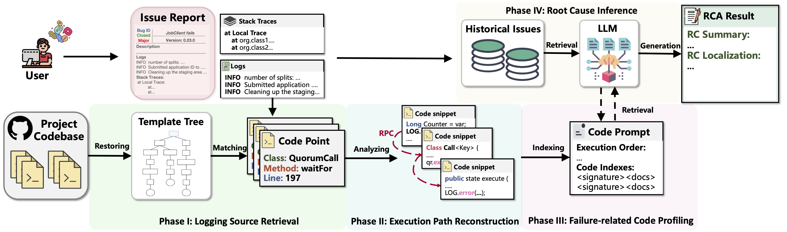

# README
This is the anonymous replication package for the submission "COCA: Generative Root Cause Analysis for Distributed Systems with Code Knowledge". In this paper, we propose propose COCA, a code knowledge enhanced root cause analysis approach for issue reports.



COCA consists of four phases: Logging Source Retrieval, Execution Path Reconstruction, Failure-Related Code Profiling, Root Cause Analysis. For each phase, **we have built (multiple) reusable and pre-built tools** for further research, to avoid any compiliation issues and to make the replication process easier.

The recommended environment for running the tools is:

+ Python 3.x 
+ JDK 17 
+ libprotoc 27.1


We will maintain this open source tool once the paper get accepted and continue improve the tool for further practical application.

## Repository Organization
```bash
├── Build
│   ├── executionPathGen.jar # analyze the execution paths
│   ├── logRestore.jar # log restoring
│   ├── reconstructPath.jar # reconstruct the execution paths
│   └── sourceExtracotr.jar # extract the source code
├── Figure
│   ├── coca.jpg
├── README.md
├── requirements.txt
├── Data
│   ├── gt # ground truth
│   │   ├── Localization # root cause localization
│   │   │   └── ca-1011
│   │   │   └── ...
│   │   ├── Summary # root cause summary
│   ├── metaData # meta data
│   │   ├── ca-1011.json 
│   └── parsed_logs_traces # parsed logs and traces
├── logRestore # log restoring
│   ├── logRestore.jar
│   ├── LogStateGen.java
│   ├── Util
│   │   ├── CallGraphCounter.java 
│   │   ├── LogMethod.java 
│   │   ├── Path2LogString.java 
│   │   ├── ...
├── logSouce # log sourcing
│   ├── jira_crawler.py
│   ├── log2code.py
│   ├── src_crawler.py
│   ├── template_tree.py
├── executionPathReconstruction
│   ├── get_path
│   │   ├── out
│   │   ├── lib
│   │   ├── src
│   │   │   └── analyzer
│   │   │   │  └── BlockNumDepethAnalyzer.java
│   │   │   │  └── ClientContextAnalyzer.java
│   │   │   │  └── PAthCoverageAnalyzer.java
│   │   │      └── ...java
│   │   │   └── getPath
│   │   │      └── ...java
│   │   │   └── utils
│   │   │      └── ...java
│   │   │   └── getClients
│   │   │      └── ...java
│   ├── RPCBridging
│   │   ├── REDME.md
│   │   ├── lib
│   │   ├── utils
│   │   │   └── commonUtils.py
│   │   │   └── gRPCUtils.py
│   │   │   └── .....py
│   │   ├── buildCG.py
│   │   ├── fuzzyMatch.py
│   │   ├── rpc_bridge.py
│   │   ├── gRPCfunc.py
│   ├── use_networkx_shortest.py
├── codeProfiling
│   ├── sourceExtractor.java
│   ├── retrieval.py
├── infer
├── ├── infer.py
├── utils
│   ├── __init__.py
│   ├── claude_request.py
│   ├── openai_request.py
└── ThirdParty
    ├── javacg-0.1-SNAPSHOT-static.jar
    └── soot-4.3.0-jar-with-dependencies.jar
```

## Datasets
We provide the collected and labelled datasets in the folder `data`. 

* meta data: The `metaData` folder contains the id, title, original link (e.g., https://issues.apache.org/jira/browse/CASSANDRA-2525), description, and other information of the collected issues.
* parsed logs and traces: The `parsed_logs_traces` folder contains the parsed logs and traces of the collected issues.
* gt: The `gt` folder contains the ground truth of the collected issues, containing the both root cause summary  (in folder `summary`) and the root cause localization resulst (in folder `localization`).

## Tools
### Data preparation
First of all, we need to determine the version of the system (from `BugId.json`), all the following steps are based on the version of the system.
To reproduce the static analysis part, you need to prepare the following data:
1. The source code of the project for source code analysis.
You can use `src_crawler.py` to crawl the source code of the project. 
2. All the jar files for bytecode analysis.

### Logging Source Retrieval
Instruction for generating the original logging tempaltes:
```bash
java -jar logRestore.jar -j project_1.jar -o log_tempaltes.txt
```

Instruction for matching the original logging tempaltes:
```bash
python template_tree.py --logs path_to_logs.txt --templates log_tempaltes.txt > log2template.txt
```

### Execution Path Reconstruction
Instruction for generating the traditional callgraph:
```bash
java -jar javacg-0.1-SNAPSHOT-static.jar project_1.jar ... > cg.txt
```

Instruction for generating the patched callgraph:
```bash
Python rpc_bridge.py [-h] --bin_project_dir BIN_PROJECT_DIR --src_project_dir SRC_PROJECT_DIR > cg.txt
```

```bash
optional arguments:
  --bin_project_dir BIN_PROJECT_DIR
                        The binary directory of the project, your project should be in
                        complied format(i.e., .class files, jar files).
  --src_project_dir SRC_PROJECT_DIR
                        The source code directory of the project, your project should be in
                        source code format(i.e., .java files).
```

Instruction for generating the execution path:
```bash
java -jar reconstructPaths.jar -c callstack -j project_1.jar -option > execution_paths.txt
```

```bash
optional arguments:
 -bd,--CVEBlockDepth                  get block depth of method list
 -c,--callStackFile <arg>             File thatcontains call stack
 -cl,--ConstraintLength               get the number of constraint along
                                      the path
 -co,--ConstraintOperand              get the operand of constraint along
                                      the path
 -cr,--ConstraintVariableReturnType   get information about return type of
                                      the constraint variable
 -cs,--CallSiteInfo                   get information about the call
 -cv,--ConstraintVariable             get the type of variable involved in
                                      the constraint along the path
 -j,--jarName <arg>                   Jar file that to be analysed
```

### Failure-Related Code Profiling
Instruction for indexing and retrieving the intrested method signatures:
```bash
python retrieval.py > methodSignature
```

Instruction for retrieving the method code:
```bash
java -jar sourceExtractor.jar -i cg.txt -m methodSignature -d projectSrcDir > related_code.txt
```

### Root Cause Analysis
Instruction for the final inference:
```bash
python infer.py bug_id.json --historical_issues historical_issues --execution_paths execution_paths --related_code related_code
```
